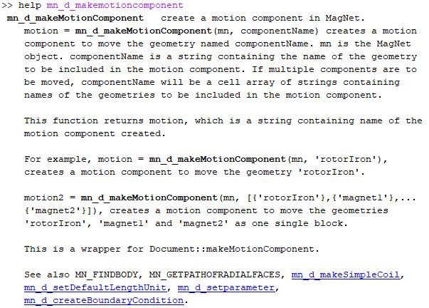

# eMach
An open source framework for modeling [electric] machinery.

## MATLAB Style Guidelines

All contributors to eMach are asked to use specific MATLAB code style, use MATLAB's object oriented programming (OOP) capabilities, and follow the SOLIDD design principles&mdash;all of which are now outlined.

### Code Style
Using a consistent writing style makes shared code more maintainable, useful, and understandable. Contributors to eMach should follow the guidelines provided [here](https://www.mathworks.com/matlabcentral/fileexchange/46056-matlab-style-guidelines-2-0). 

A brief summary of guidelines for names includes:
- **Avoid using excessively short names:** instead, favor full words to convey meaning
- **Function and variable names:** start lower case and then move to camel case, i.e. `toInch()`
- **Class names:** start upper case and then move to camel case, i.e. `MaterialGeneric`


Follow the MATLAB editor's guidelines on maximum line length. Wrapping to multiple lines is preferred over code that has excessively wide lines. This is for readability and printability reasons.

### Object-Oriented Programming
The reference manual for MATLAB OOP can be found [here](https://www.mathworks.com/help/pdf_doc/matlab/matlab_oop.pdf).

Those looking to quickly grasp the key concepts of Matlab's implementation of OOP are referred to Kevin Murphy's [Object Oriented Programming in Matlab: basics guide](https://www.cs.ubc.ca/~murphyk/Software/matlabTutorial/html/objectOriented.html) and the official MATLAB [class syntax guide](https://www.mathworks.com/help/matlab/class-syntax-guide.html). MATLAB's instructions for creating help documentation of classes can be found [here](https://www.mathworks.com/help/matlab/matlab_prog/create-help-for-classes.html).

### SOLIDD Approach to Object Oriented Code Design
SOLIDD is an acronymn for the following code design guidelines:

- [**Single responsibility principle**](https://web.archive.org/web/20150202200348/http://www.objectmentor.com/resources/articles/srp.pdf) _“a class should have only a single responsibility” or “a class should have only one reason to change”_
- [**Open/closed principle**](https://web.archive.org/web/20150905081105/http://www.objectmentor.com/resources/articles/ocp.pdf) _"software entities … should be open for extension, but closed for modification."_
- [**Liskov substitution principle**](https://web.archive.org/web/20150905081111/http://www.objectmentor.com/resources/articles/lsp.pdf) _"objects in a program should be replaceable with instances of their subtypes without altering the correctness of that program."_
- [**Interface segregation principle**](https://web.archive.org/web/20150905081110/http://www.objectmentor.com/resources/articles/isp.pdf) _"Many client-specific interfaces are better than one general-purpose interface."_
- [**Dependency inversion principle**](https://web.archive.org/web/20150905081103/http://www.objectmentor.com/resources/articles/dip.pdf) _One should "depend upon abstractions, [not] concretions."_
- **Don't repeat yourself**

These guidelines come out of the [Agile](https://en.wikipedia.org/wiki/Agile_software_development) community (specifically, [Robert C. Martin](https://en.wikipedia.org/wiki/Robert_C._Martin)) and are intended to make code flexible and maintainable. They are subtle and require close study to grasp their full implications.  

Note that MATLAB is a dynamically typed language and therefore does not impose type restrictions on variables. This can make adherence to the SOLIDD princples challenging. eMach enforces typing manually enforced by calling `validateattributes` like this:
- `validateattributes(obj.dim_depth,{'dimLinear'},{'nonnegative', 'nonempty'})`
- `validateattributes(compArcObj,{'compArc'},{'nonempty'})`

For example, see the MATLAB [DimLinear class](https://github.com/Severson-Group/eMach/blob/73293d352750b54190ffbddf509158881f4d8c1f/model_obj/dimensions/DimLinear.m).

Several useful resources on the SOLIDD guidelines are assembled here:
- [Wikipedia article on SOLID](https://en.wikipedia.org/wiki/SOLID)
- [Matlab blog on open and closed principle](https://blogs.mathworks.com/developer/2015/12/18/open-and-extensible/)
- [Matlab blog on class design](https://blogs.mathworks.com/developer/2016/01/16/making-code-usable-useful-and-testable/)
- [Matlab blog on inversion of control](https://blogs.mathworks.com/developer/2016/02/16/inversion-of-control/)
- [Matlab blog on dependency inversion](https://blogs.mathworks.com/developer/2016/02/24/dependency-injection/)

### In Function Documentation
Providing clear and concise in-function documentation makes open source code easy to understand and more useful. Contributors to eMach should follow the MATLAB function documentation guidelines.

Throughout the documentation, the function name should be typed in upper case, i.e. `mn_d_makeMotionComponent` as `MN_D_MAKEMOTIONCOMPONENT`. Doing this causes MATLAB to render the function name in bold face.

The function documentation block should consist of the following components:

1. **Function summary:** The first line of the function documentation block should consist of the function name followed by a brief summary of the function. Example: `MN_D_MAKEMOTIONCOMPONENT   create a motion component in MagNet`
2. **Function signatures:** Starting with the second line, all possible function signatures are provided along with their description. This should include the following information:
   1. *Function signature and brief description:* The exact function signature should be provided and followed immediately by a one sentence description of what the function accomplishes when invoked with this signature.
   2. *Argument descriptions:* A description of each argument should provided. This is expected to directly continue from the function signature description (no vertical whitespace is to be inserted).
   3. *Return value description:* The return value should be described. This will be in a new paragraph following the argument descriptions.
   4. *Example use cases:* Provide example use cases, with each example in its own paragraph. Be as descriptive as possible.
   
   **Note:** If a function has multiple function signatures, all of them must be described, in order of fewest arguments provided to most arguments provided. Each subsequent function signature should only add additional information. Do not re-describe the arguments and return values that were introduced by previous signatures.
3. **Related functions:** Finally, list related functions that a user interested in this function is likely to use.
 
Here is an example of a function documentation block that follows this specification:

```matlab
%MN_D_MAKEMOTIONCOMPONENT   create a motion component in MagNet.
%   motion = MN_D_MAKEMOTIONCOMPONENT(mn, componentName) creates a motion 
%   component to move the geometry named componentName. mn is the MagNet 
%   object. componentName is a string containing the name of the geometry 
%   to be included in the motion component. If multiple components are to 
%   be moved, componentName will be a cell array of strings containing 
%   names of the geometries to be included in the motion component.
%   
%   This function returns motion, which is a string containing name of the 
%   motion component created.
%
%   For example, motion = MN_D_MAKEMOTIONCOMPONENT(mn, 'rotorIron'), 
%   creates a motion component to move the geometry 'rotorIron'. 
%   
%   motion2 = MN_D_MAKEMOTIONCOMPONENT(mn, [{'rotorIron'},{'magnet1'},...
%   {'magnet2'}]), creates a motion component to move the geometries 
%   'rotorIron', 'magnet1' and 'magnet2' as one single block.
%
%   This is a wrapper for Document::makeMotionComponent.
%
%   See also MN_FINDBODY, MN_GETPATHOFRADIALFACES, MN_D_MAKESIMPLECOIL, 
%   MN_D_SETDEFAULTLENGTHUNIT, MN_D_SETPARAMETER, 
%   MN_D_CREATEBOUNDARYCONDITION.

```
**Indentation / Horizontal white spaces:**
Indentation consistent with MATLAB style guidelines should be followed.
The key style requirements are summarized as follows:
- First line: the function name `MN_D_MAKEMOTIONCOMPONENT` should have no indentation; three spaces should be placed between the function name and the brief summary. 
- All other lines: the documentation text should be indented from `%` by exactly three spaces.
- Follow the MATLAB editor default guidelines on maximum line length (76 characters).

If formatted as above, typing `help mn_d_makeMotionComponent` in the MATLAB command window gives the following output:

 
