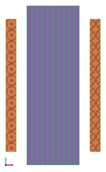

# Lamination Problem Example

This MagNet example builds a laminated iron material placed inside a solenoid excited by a sinusoidal current, solves it (static, transient or time-harmonic), and extracts iron eddy current losses and magnetic field density. These parameters are compared for different number of laminations (from 1 to 20, and 50), while keeping the total iron thickness unchanged. For transient and time-harmonic solvers, the iron eddy current losses are obtained by specifying the iron conductivity (not using Steinmetz equations at post-processing).

Main Matlab functions and folders are:

* [ConstructLaminationExample.m](ConstructLaminationExample.m) – constructs the model in MagNet. User specifies the number of laminations.

* [PlotResults.m](PlotResults.m) – plots all results using .mat files obtained by solving an example model. Plots are obtained for two different iron materials, M-19 24 Ga and Hiperco.

* [StaticSolveLaminationExample.m](StaticSolveLaminationExample.m) – solves the model using static solver.

* [THSolveLaminationExample.m](THSolveLaminationExample.m) – solves the model using time-harmonic solver.

* [TransientSolveLaminationExample.m](TransientSolveLaminationExample.m) – solves the model using transient solver.

* [PlotResults](PlotResults/) folder – includes all Matlab plot results in .svg format.

Example model with 10 laminations is shown below:

